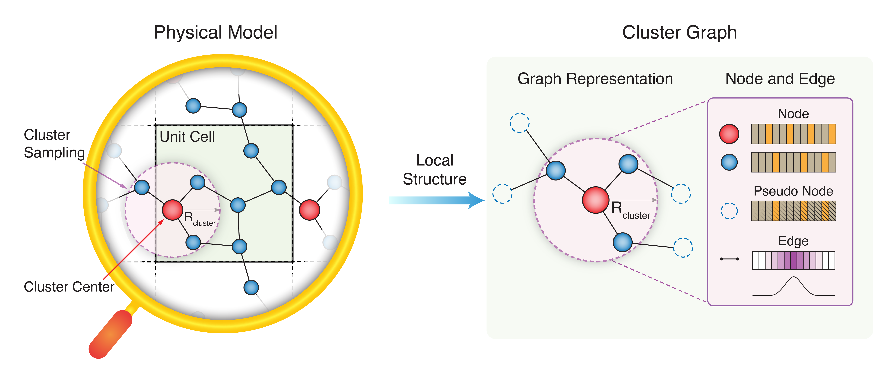

# CG-NET: A Physics-Informed Cluster Graph Neural Network

A PyTorch implementation of Cluster Graph Neural Network for materials property prediction.



## Features

- **Cluster-Based Graph Construction**: Utilizes localized atomic clusters for high-fidelity material graph representation.
- **Periodic Boundary Integration**: Explicitly incorporates periodicity to preserve crystal lattice continuity.
- **Pseudo Node Design**: Embeds boundary-specific structural and chemical cues to enhance graph expressiveness.
- **Adaptable Featurization**: Enables customizable graphs via adjustable cluster radius and neighbor criteria.
- **Optimized Weighted Pooling**: Employs efficient strategies for scalable and fast aggregation.
- **Versatile Task Support**: Supports both regression and classification across varied materials datasets.

## Installation

### Reproducible Installation (Recommended)

For exact reproducibility of the development environment, use the pinned dependencies:

```bash
git clone https://github.com/your-username/cgnet.git
cd cgnet

# Install with exact versions used in development
pip install -r requirements.txt
pip install -e .
```

This installs the exact versions tested by the authors and ensures reproducibility across different environments and time periods.

### Alternative: Flexible Installation

For the latest compatible versions (may differ from development environment):

```bash
git clone https://github.com/your-username/cgnet.git
cd cgnet
pip install -e .
```

## Quick Start

### CLI Usage (Recommended)

The easiest way to use CG-NET is through the command-line interface:

```bash
# Create a default configuration file
python -m cgnet.cli --use-defaults

# Train with custom configuration file
python -m cgnet.cli --config config.yml

# Train with custom parameters
python -m cgnet.cli --config config.yml --epochs 200 --batch-size 64 --lr 0.001

# Create optimized configurations for different tasks
python -m cgnet.cli --create-template regression --template-output regression_config.yml
python -m cgnet.cli --create-template classification --template-output classification_config.yml

# Run only prediction with a trained model
python -m cgnet.cli --config config.yml --mode predict --checkpoint model.ckpt

# Submit to SLURM cluster
python -m cgnet.cli --config config.yml --slurm --partition gpu --time 12:00:00
```

### Programmatic Usage

#### Basic Training Pipeline

```python
from cgnet.trainers import CGNETTrainer

# Initialize trainer with configuration
trainer = CGNETTrainer('config.yml')

# Run complete pipeline
trainer.run_pipeline(mode="all")  # data + train + test

# Or run individual steps
trainer.run_pipeline(mode="data")     # Generate dataset only
trainer.run_pipeline(mode="train")    # Train model only
trainer.run_pipeline(mode="test")     # Test model only
```

## Project Structure

```
CG-NET/
├── cgnet/                    # Main package
│   ├── __init__.py             # Package exports
│   ├── models/              # Neural network models
│   │   ├── __init__.py
│   │   └── model.py            # CGNET model implementation
│   ├── utils/               # Data processing utilities
│   │   ├── __init__.py
│   │   ├── data.py             # Featurization and datasets
│   │   └── atom_init.json      # Atomic feature initialization
│   ├── trainers/            # Modular training pipeline
│   │   ├── __init__.py         # Trainer exports
│   │   ├── trainer.py          # Main orchestrator
│   │   ├── config_manager.py   # Configuration management
│   │   ├── data_manager.py     # Data pipeline
│   │   ├── model_manager.py    # Model lifecycle
│   │   ├── training_manager.py # Training operations
│   │   ├── slurm_manager.py    # SLURM integration
│   │   └── README.md           # Detailed trainer docs
│   ├── cli/                 # Command line interface
│   │   ├── __init__.py
│   │   ├── main.py             # CLI entry point
│   │   ├── utils.py            # CLI utilities
│   │   ├── templates.py        # Config templates
│   │   └── validators.py       # Config validation
│   └── ⚙️ configs/             # Configuration examples
├── pyproject.toml           # Modern project configuration
├── requirements.txt         # Pinned dependencies
├── README.md                # Project documentation
├── LICENSE                  # License
└── __init__.py                 # Root package API
```

## License

This project is licensed under the MIT License - see the LICENSE file for details.

## Citation

If you use this code in your research, please cite:

```bibtex
@software{cgnet,
    title={A physics-informed cluster graph neural network enables generalizable and interpretable prediction for material discovery},
    author={Cheng Hao},
    year={2025},
    url={https://github.com/your-username/cgnet}
}
```