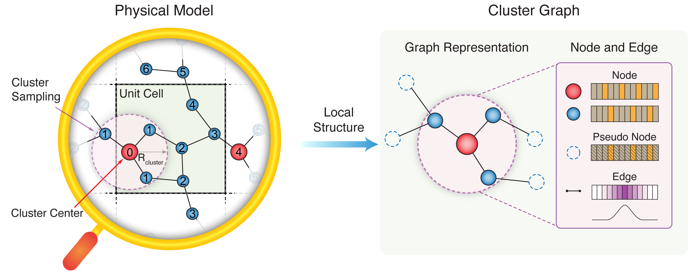

# CG-NET: Physics-Informed Cluster Graph Neural Network

A PyTorch implementation of Cluster Graph Neural Network for materials property prediction.



## Features

- **Cluster-Based Graph Construction**: Utilizes localized atomic clusters for high-fidelity material graph representation.
- **Periodic Boundary Integration**: Explicitly incorporates periodicity to preserve crystal lattice continuity within finite clusters.
- **Pseudo Node Design**: Embeds boundary-specific structural and chemical information via pseudo nodes, enhancing graph expressiveness.
- **Adaptable Featurization**: Offers flexible graph definitions via tunable cluster radius and neighbor criteria.
- **Optimized Weighted Pooling**: Implements efficient pooling strategies for scalable and accelerated aggregation.

## Installation

```bash
conda create -n cgnet-env python=3.11 -y
conda activate cgnet-env
git clone https://github.com/hchenglab/CG-NET.git
cd CG-NET
pip install -e .
```

## Quick Start

### CLI Usage

```bash
# Create default configuration
python -m cgnet.cli --use-defaults

# Train with configuration
python -m cgnet.cli --config config.yml

# Train with custom parameters
python -m cgnet.cli --config config.yml --epochs 200 --batch-size 64 --lr 0.001

# Generate task-specific templates
python -m cgnet.cli --create-template regression --save-config regression_config.yml

# Prediction only
python -m cgnet.cli --config config.yml --mode predict --checkpoint model.ckpt

# SLURM submission
python -m cgnet.cli --config config.yml --slurm --partition gpu --time 12:00:00
```

### Programmatic Usage

```python
from cgnet.trainers import CGNETTrainer

# Initialize and run pipeline
trainer = CGNETTrainer('config.yml')
trainer.run_pipeline(mode="all")  # data + train + test

# Individual steps
trainer.run_pipeline(mode="data")     # Generate dataset only
trainer.run_pipeline(mode="train")    # Train model only
trainer.run_pipeline(mode="test")     # Test model only
```

## Project Structure

```
CG-NET/
├── cgnet/                   # Main package
│   ├── models/              # Neural network models
│   ├── utils/               # Data processing utilities
│   ├── trainers/            # Training pipeline
│   ├── cli/                 # Command line interface
│   └── configs/             # Configuration examples
├── assets/                  # Documentation assets
├── datasets/                # Dataset storage
├── pyproject.toml           # Project configuration
├── requirements.txt         # Dependencies
└── README.md                # Documentation
```

## Datasets

The datasets employed in this project include the high-entropy alloy (HEA), [two-dimensional impurity (2D-impurity)](https://www.nature.com/articles/s41699-023-00380-6), [Open Catalyst 2020 (OC20)](https://pubs.acs.org/doi/10.1021/acscatal.0c04525) and [Open DAC 2023 (ODAC23)](https://pubs.acs.org/doi/10.1021/acscentsci.3c01629) datasets. Please refer to the manuscript for dataset details and experimental setup.

### Data Format Requirements

- **Structure files**: ASE-compatible trajectory formats (.traj)
- **Properties file**: CSV file named `id_prop_index.csv` with columns: 
    - `id`: Identifier matching the structure file name
    - `label`: Target property value
    - `cidxs`: Atom indices identifying the cluster center (for multiple centers, use `cidx_1, cidx_2, ...`)

## License

This project is licensed under the MIT License - see the LICENSE file for details.

## Citation

If you use this code in your research, please cite:

```bibtex
@software{cgnet,
    title={A physics-informed cluster graph neural network enables generalizable and interpretable prediction for material discovery},
    author={Cheng Hao},
    year={2025},
    url={https://github.com/hchenglab/CG-NET}
}
```
